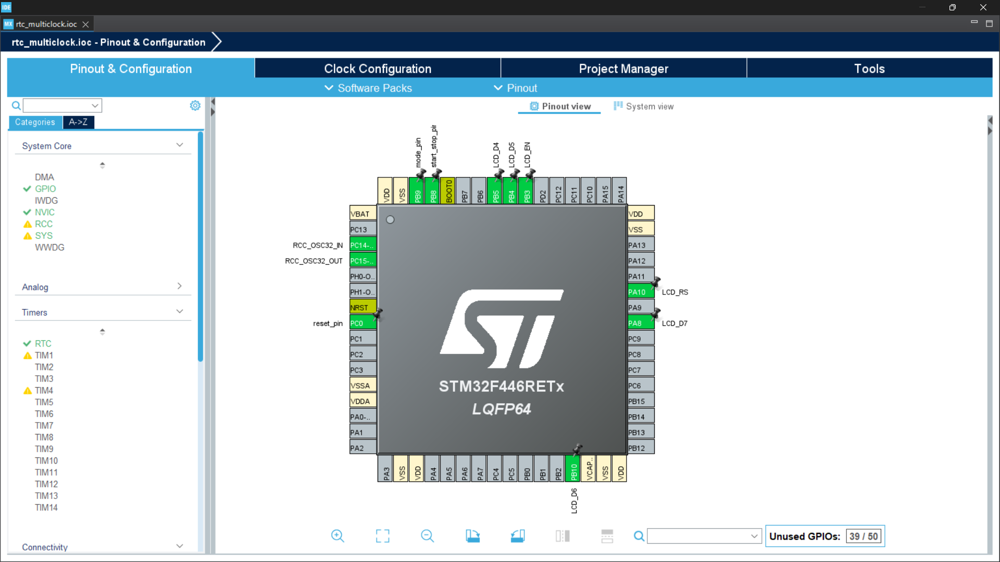
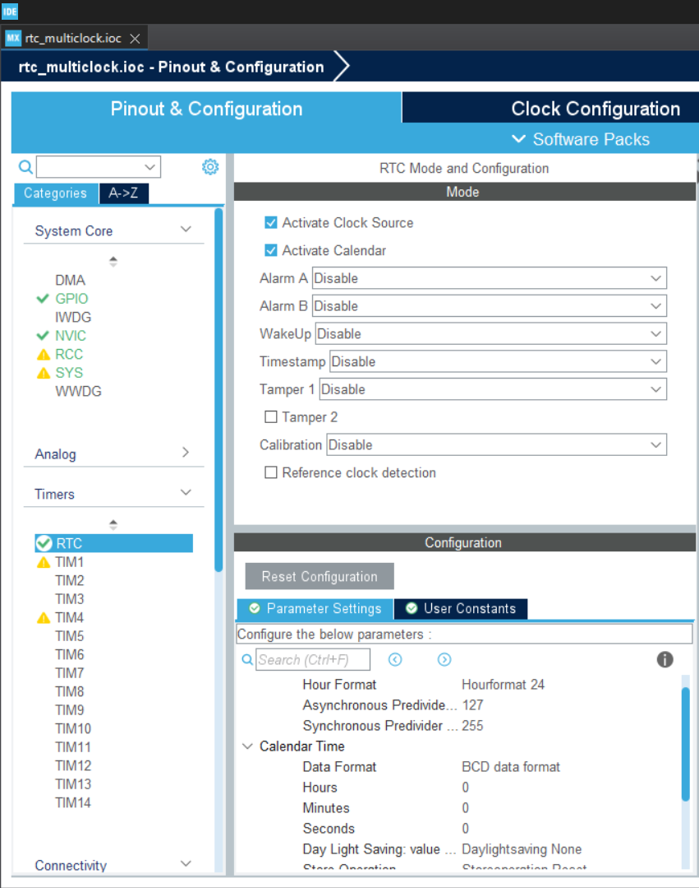
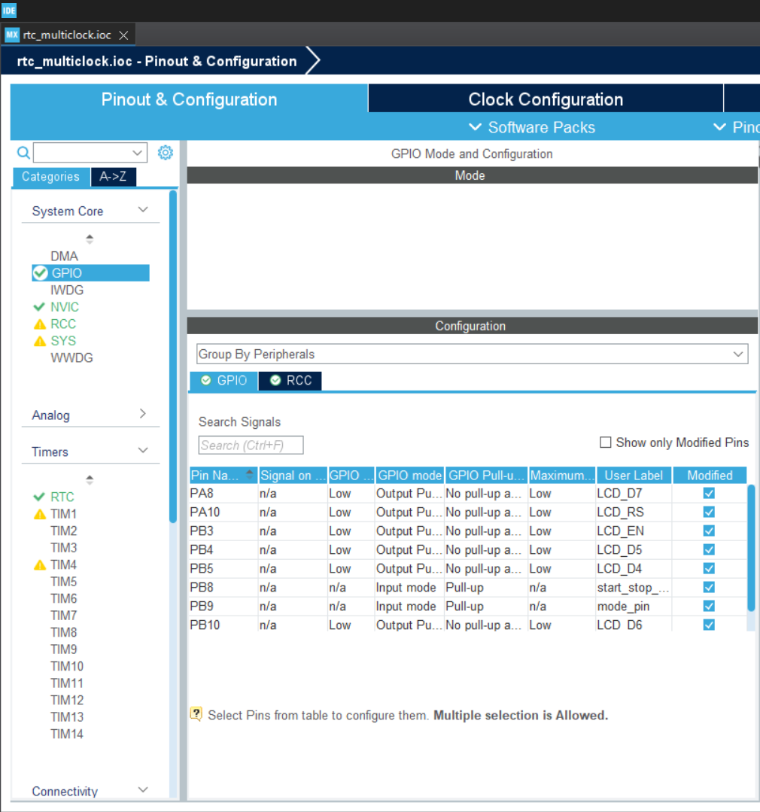

# ⏰ Multi-Purpose Digital Clock using STM32F446RE

A multi-functional embedded system project implementing a **Real-Time Clock (RTC)**, **Stopwatch**, and **Time-Setting Interface** using the STM32F446RE microcontroller and a 16×2 LCD display.

---

## 📌 Features
- ✅ RTC-based digital clock (HH:MM:SS)
- ✅ Stopwatch with millisecond precision
- ✅ Time setting mode (hours & minutes)
- ✅ Internal RTC with backup domain
- ✅ 16×2 LCD UI with blinking selection
- ✅ Custom startup animation
- ✅ Button debouncing & long-press handling
- ✅ Modular and expandable architecture

---

## 🧠 Motivation
Although the STM32F446RE is overkill for a simple clock, it was intentionally chosen to explore:
- Advanced RTC peripherals
- HAL-based embedded development
- State-machine driven UI design
- Scalability for future features

---

## 🛠 Hardware Used
| Component | Description |
|---------|-------------|
| STM32F446RE | Nucleo-64 development board |
| 16×2 LCD | HD44780 compatible |
| Push Buttons | Mode, Start/Stop, Reset |
| Potentiometer | LCD contrast control |
| 32.768 kHz Crystal | RTC timebase |
| (Optional) LDR | Auto brightness (future) |

---

## ⚙️ Software & Tools
- STM32CubeIDE
- HAL Drivers
- ARM Cortex-M4
- Git + GitHub

---

## 🧩 Operating Modes
1. **Clock Mode**  
   Displays real-time clock using RTC

2. **Stopwatch Mode**  
   Start / Stop / Reset stopwatch using system tick

3. **Settings Mode**  
   - Adjust hours
   - Adjust minutes
   - Save time to RTC

---

## 📷 Project Preview

### Clock Mode

### Stopwatch Mode

### Hardware Setup

---

## 🚀 How to Run
1. Clone the repository
2. Open project in STM32CubeIDE
3. Build & flash to STM32F446RE
4. Power board via USB
5. Use buttons to navigate modes
---
# 🔧 Hardware Configuration

This document describes the complete hardware configuration and GPIO pin mapping
for the **Multi-Purpose Digital Clock using STM32F446RE**.

All pins are configured using **STM32CubeMX**, and the labels used here directly
match the definitions in `main.h`.

---

## 🧠 Microcontroller Details

- **Board:** STM32F446RE (NUCLEO-F446RE)
- **Core:** ARM Cortex-M4F
- **Operating Voltage:** 3.3 V
- **System Clock:** HSI + PLL  
- **RTC Clock Source:** LSE (32.768 kHz crystal)

---

## 📟 16×2 LCD (HD44780 Compatible) — 4-Bit Mode

| LCD Signal | STM32 Pin | GPIO Port | Description |
|-----------|----------|-----------|-------------|
| RS | PA10 | GPIOA | Register Select (Command/Data) |
| EN | PB3 | GPIOB | Enable pin (Data latch) |
| D4 | PB5 | GPIOB | Data line D4 |
| D5 | PB4 | GPIOB | Data line D5 |
| D6 | PB10 | GPIOB | Data line D6 |
| D7 | PA8 | GPIOA | Data line D7 |
| VSS | GND | — | Ground |
| VDD | +5 V | — | LCD Power |
| V0 | Potentiometer | — | LCD Contrast Control |

✅ LCD is driven in **4-bit parallel mode** to reduce GPIO usage.

---

## 🔘 Push Button Configuration

| Function | STM32 Pin | GPIO Port | Configuration |
|--------|----------|-----------|---------------|
| Mode Change | PB9 | GPIOB | Input, Pull-Up |
| Start / Stop / Select | PB8 | GPIOB | Input, Pull-Up |
| Reset / Increment | PC0 | GPIOC | Input, Pull-Up |

- Buttons are **Active-LOW**
- Software debouncing implemented using `HAL_GetTick()`

---

## ⏱ Real-Time Clock (RTC) Configuration

| Parameter | Value |
|---------|-------|
| Peripheral | Internal RTC |
| Clock Source | LSE (32.768 kHz crystal) |
| Time Format | 24-Hour |
| Backup Domain | Supported (VBAT capable) |

The RTC operates independently of the main CPU clock and maintains time across resets.

---

## 🖥 STM32CubeMX Pin Configuration Snapshot

The following image shows the STM32CubeMX pin configuration used in this project.

### RTC setup

### GPIO Setup

---

## ✅ Notes

- All GPIO macros are defined in `main.h`
- Logical abstractions are handled in `parallel_lcd.h`
- Any pin reassignment can be done entirely via STM32CubeMX
  without modifying application or driver logic

---

📁 Related files:
- `main.h`
- `parallel_lcd.h`
- `hardwareconfig.md`
---

## 🔮 Future Improvements
- Alarm functionality
- LDR-based auto brightness
- Buzzer / LED alerts
- Low-power sleep modes
- Wireless sync (ESP / BLE)

---

## 👤 Author
**Jayant Chopra**  
B.Tech ECE  
LNMIIT Jaipur  

---

## 📜 License
This project is for academic and learning purposes.
