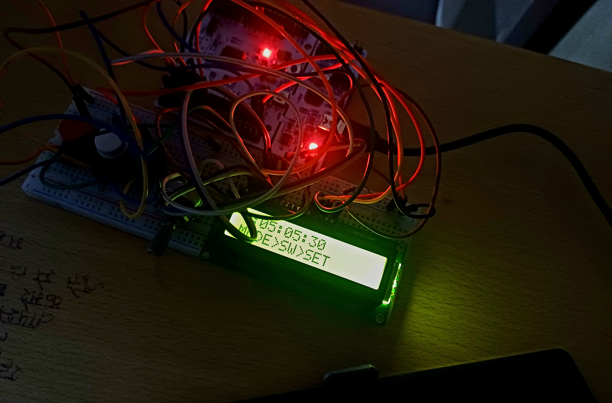
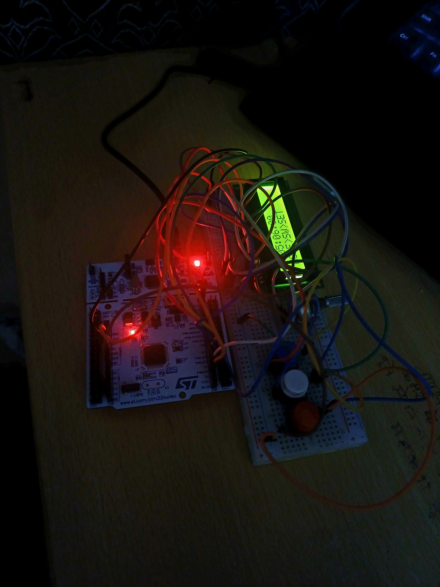

# ⏰ Multi-Purpose Digital Clock using STM32F446RE

A multi-functional embedded system project implementing a **Real-Time Clock (RTC)**, **Stopwatch**, and **Time-Setting Interface** using the STM32F446RE microcontroller and a 16×2 LCD display.

---

## 📌 Features
- ✅ RTC-based digital clock (HH:MM:SS)
- ✅ Stopwatch with millisecond precision
- ✅ Time setting mode (hours & minutes)
- ✅ Internal RTC with backup domain
- ✅ 16×2 LCD UI with blinking selection
- ✅ Custom startup animation
- ✅ Button debouncing & long-press handling
- ✅ Modular and expandable architecture

---

## 🧠 Motivation
Although the STM32F446RE is overkill for a simple clock, it was intentionally chosen to explore:
- Advanced RTC peripherals
- HAL-based embedded development
- State-machine driven UI design
- Scalability for future features

---

## 🛠 Hardware Used
| Component | Description |
|---------|-------------|
| STM32F446RE | Nucleo-64 development board |
| 16×2 LCD | HD44780 compatible |
| Push Buttons | Mode, Start/Stop, Reset |
| Potentiometer | LCD contrast control |
| 32.768 kHz Crystal | RTC timebase |
| (Optional) LDR | Auto brightness (future) |

---

## ⚙️ Software & Tools
- STM32CubeIDE
- HAL Drivers
- ARM Cortex-M4
- Git + GitHub

---

## 🧩 Operating Modes
1. **Clock Mode**  
   Displays real-time clock using RTC

2. **Stopwatch Mode**  
   Start / Stop / Reset stopwatch using system tick

3. **Settings Mode**  
   - Adjust hours
   - Adjust minutes
   - Save time to RTC

---

## 📷 Project Preview

### Clock Mode

### Stopwatch Mode

### Hardware Setup

---

## 🚀 How to Run
1. Clone the repository
2. Open project in STM32CubeIDE
3. Build & flash to STM32F446RE
4. Power board via USB
5. Use buttons to navigate modes

---

## 🔮 Future Improvements
- Alarm functionality
- LDR-based auto brightness
- Buzzer / LED alerts
- Low-power sleep modes
- Wireless sync (ESP / BLE)

---

## 👤 Author
**Jayant Chopra**  
B.Tech ECE  
LNMIIT Jaipur  

---

## 📜 License
This project is for academic and learning purposes.
